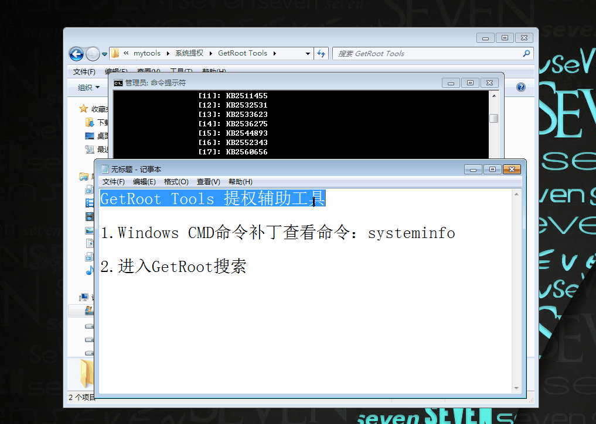

# GetRoot-Tools
A tools help you to get root.提权辅助工具
> GetRoot Tools.exe MD5:ce4777362c275e08e4951c070700e297

## 更新内容
1. 修复了兼容性
2. 对尾部空格进行了删除(随性化)

## 功能点
* Windows的补丁对比
* 常用的CMD命令
* 反弹转发工具的命令
* 干掉安全狗程序的命令
* UDF、MOF、SA提权技巧

## Config文件夹
config文件夹内的txt文件可以自行修改

## 使用方法

